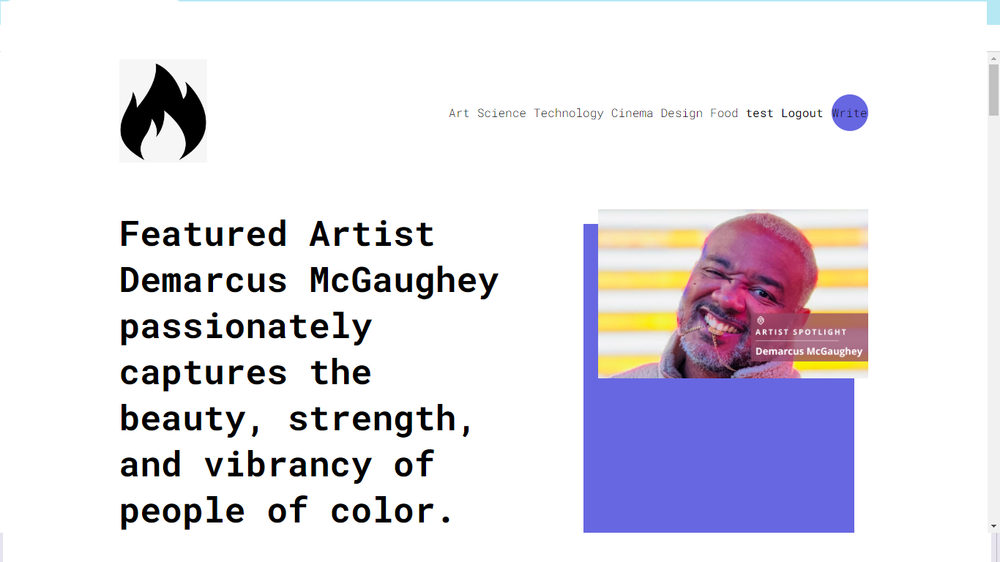

# 💻 Tech Stack:
      

                Homepage of blog website
                
 
 Login page
 
writing component using react quill with category functionality 

 updating and deletion of post after jwt authenticates author of post also fetching similar post in the sidebar
 
 
 passing categories as query
